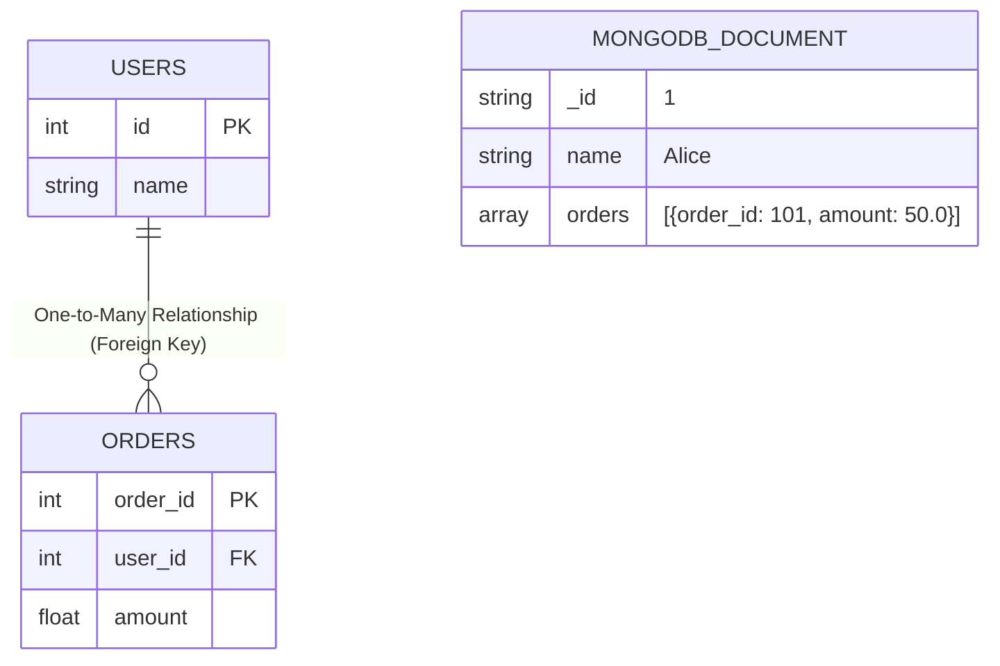

# What is Database Management?

**Database Management** refers to the procedures and software used to store, organize, retrieve, and secure data in a computer system. At its core, it ensures that data is consistently available to users and applications while remaining secure. 

It is typically handled by a **Database Management System (DBMS)**, which acts as a bridge between the end-users, the applications, and the data itself.

### Key Functions of a DBMS:
1. **Data Organization:** Defining schemas and structures to optimally store data (like tables, documents, arrays).
2. **Data Manipulation:** Allowing users to easily insert, update, delete, and query data.
3. **Data Security & Authorization:** Controlling who has access to view or change specific pieces of data.
4. **Data Integrity:** Ensuring rules and constraints are followed, so data doesn't become corrupt or inaccurate.
5. **Concurrency Control:** Managing multiple users accessing or modifying the exact same data simultaneously without crashing or creating conflicts.
6. **Backup and Recovery:** Automating backups to restore data safely in case of a system failure.

---

# Relational vs Non-Relational Databases

| Feature | Relational (e.g., PostgreSQL) | Non-Relational (e.g., MongoDB) |
| :--- | :--- | :--- |
| **Schema Design** | Rigid, predefined tables/columns | Flexible, schema-less documents |
| **Data Structure** | Structured rows & columns | JSON-like BSON documents |
| **Relationships** | Foreign keys & Normalization (Joins) | Embedded data & Denormalization |
| **Availability** | ACID principles (Consistency focus) | BASE principles (Availability focus) |
| **Scaling** | Vertical scaling (Scale-up) | Horizontal scaling (Scale-out) |
| **Performance** | Optimized for complex queries | Optimized for high throughput & massive scale |
| **Cost** | Higher server cost (Vertical) | Commodity hardware (Horizontal) |


<br>
<br>

## Data Storage Architecture



<br>

## SQL vs. NoSQL Explained
- **SQL (Structured Query Language):** The standard language used by **Relational Databases**. SQL databases are table-based, require a predefined schema, and rely heavily on complex `JOIN` operations to connect data across tables.
- **NoSQL (Not Only SQL):** Represents **Non-Relational Databases**. NoSQL databases do not use tabular relations and have flexible schemas. They optimize for scale, speed, and specific data models (like documents, key-value pairs, or graphs).

## Common Database Categories

| Database Category | Popular Examples | Storage Format |
| :--- | :--- | :--- |
| **Relational (SQL)** | PostgreSQL, MySQL, SQLite, Oracle, SQL Server | Structured Tables (Rows/Columns) |
| **Non-Relational (NoSQL)** | MongoDB, CouchDB<br>Redis, Memcached, DynamoDB<br>Cassandra, HBase<br>Neo4j, Amazon Neptune | Document-based (JSON/BSON)<br>Key-Value Pairs<br>Wide-Column Stores<br>Graph Stores |

<br>

## Why does MongoDB store `orders` inside the User document?
In a relational database, you split users and orders into separate tables and use relationships (Normalization). MongoDB takes a different approach by embedding related data directly into a single document (Denormalization).

**Why? (The Advantage):**
1. **Performance (No Joins):** Disk seeks are expensive. By keeping a user and their orders in one single JSON document, the database can fetch everything it needs in a single read operation instead of joining multiple tables.
2. **Atomic Updates:** Updating a single document ensures properties (like a user and their embedded orders) are saved atomically.

**How does it retrieve it?**
You query the document directly, and MongoDB returns the whole JSON structure.

**Example Query:**
```javascript
// Retrieve Alice's data along with all her orders instantly
db.users.findOne({ name: "Alice" });
```

**Returned Output:**
```json
{
  "_id": "1",
  "name": "Alice",
  "orders": [
    { "order_id": 101, "amount": 50.0 }
  ]
}
```


