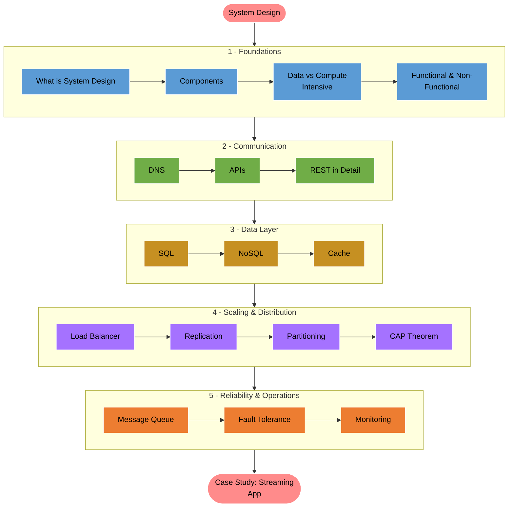
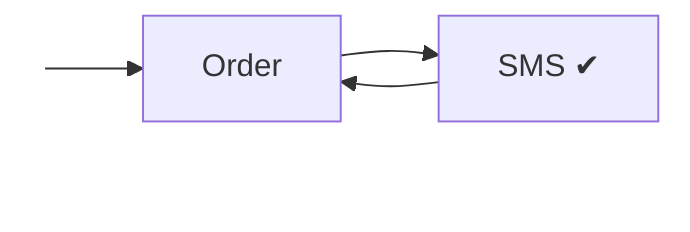

> 
 "Anyone can write code that works.   System Design is what makes it work for a million people at once." 

  

---

  

  

# System Design

> System = Components + Common Goal 

 

Components of System Design

1. Databases
    - No Sql
    - SQL

> To connect the DB and App - IP or HTTP or TCP

2. Application Code
    - APIs -> Endpoints

    > Get -> https://edge-op.com/login

3. Client Applications

  Client <---------> Server [Application Code] <----------> Database

4. Cache

5. Load Balancer

6. Message Queue

    Ordering 
    Inventory Update --> Delivery --> Mail /SMS

    > This is where message Broker like Kafka comes into picture (Asynchronous)

7. Monitoring & Logs

- Stack trace
- Reproduce those errors in order to fix them

Types of Application

- Data Intensive Application
- Compute Intensive Application

## Data Intensive Appilcation

Data -> Store, Gather, Move, Add

Platform like Instagram Feed, Whatsapp msgs, Log processing System

Database Response
Network calls
Server 

#### Concerns

- How fast can we read the data?
- How safety are we going to store the data?

- How many users can access it simultaneously?

- what happens if Machine dies?

#### Components to improve DIA

- Databases 
- Caching
- Replication
- Sharding
- Consistency

## Compute Intensive Application

Challenge -> Heavy computation

-> CPU /GPU Bound

Examples:  
- Image Processing
- Video Rendering
- ML Model Training
- Cryptography

#### Concerns

- How fast can we compute?
- Can we parallelize this work?
- How to reduce the computational cost? (Algorithm Optimization)
- Can we use GPU instead of CPU?

