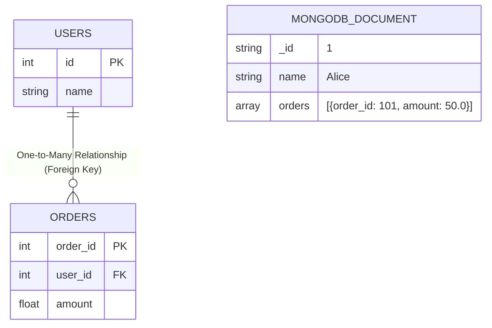

MySQL is compliant with the ANSI SQL standard


To build a web site that shows data from a database, you will need:

An RDBMS database program (like MySQL)
A server-side scripting language —> PHP
use SQL to get the data you want
use HTML / CSS to style the page


SQL vs NoSQL 
Does the syntax for DML, DDL,...-varies?


Is that possible to create a table from a selected column name of the table?

# Preparation

[] Intro
[] Project description (I should've detailly described about the project and UI/UX)
[] My Module (why api/v3/carts)
[] Active Listening


.mvn/wrapper vs pom.xml — why Maven has these files?


How does spring Security encapsulates/ hides the data, instead of directly passing through the endpoints — request parameters?

---


Controller vs RestController


(http request, Response)
---

How does the (Spring) Security Filter Chain works?


Springboot-starter-validation Vs Springboot-starter-jpa


Does both the dependencies has validation annotations?

---

spring-boot-starter-actuator


Class level Or Method/ Constructor level annotation

---

Spring life cycle

Instantiation
Dependency Injection ?
Inversion of control
Destruction


---

when application stopped, the bean is destroyed — what are the annotation used for the Bean destruction?

(like Post Construct, Pre Destroy)

---

Primary Key - uniquely identifies each rows
Foreigh Key

Can a Table have (declared a) Primary Key without even relationship to the Other table? Then what's the whole point of Primary and Foreign Key?

Does PK points out the FK in another table?
Does Primary Key can also be a Foreigh Key?

Aggregation functions - GROUP BY
     |
     v
(same values ?)


Index in table? vs  auto-increment field (How to set it)


Does react have load balancer?


Core java principles?


jenkins 

Docker - image, Container?


Design principle........patery, patterns?


BETWEEN
LIKE	
IN	


select * from fresh_greens_db.orders join fresh_greens_db.users on fresh_greens_db.orders.buyer_id=fresh_greens_db.users.id;
 


full join on Sql


<br>
<br>

## Data Storage Architecture



<br>

## SQL vs. NoSQL Explained
- **SQL (Structured Query Language):** The standard language used by **Relational Databases**. SQL databases are table-based, require a predefined schema, and rely heavily on complex `JOIN` operations to connect data across tables.
- **NoSQL (Not Only SQL):** Represents **Non-Relational Databases**. NoSQL databases do not use tabular relations and have flexible schemas. They optimize for scale, speed, and specific data models (like documents, key-value pairs, or graphs).

## Common Database Categories

| Database Category | Popular Examples | Storage Format |
| :--- | :--- | :--- |
| **Relational (SQL)** | PostgreSQL, MySQL, SQLite, Oracle, SQL Server | Structured Tables (Rows/Columns) |
| **Non-Relational (NoSQL)** | MongoDB, CouchDB<br>Redis, Memcached, DynamoDB<br>Cassandra, HBase<br>Neo4j, Amazon Neptune | Document-based (JSON/BSON)<br>Key-Value Pairs<br>Wide-Column Stores<br>Graph Stores |

<br>

## Why does MongoDB store `orders` inside the User document?
In a relational database, you split users and orders into separate tables and use relationships (Normalization). MongoDB takes a different approach by embedding related data directly into a single document (Denormalization).

**Why? (The Advantage):**
1. **Performance (No Joins):** Disk seeks are expensive. By keeping a user and their orders in one single JSON document, the database can fetch everything it needs in a single read operation instead of joining multiple tables.
2. **Atomic Updates:** Updating a single document ensures properties (like a user and their embedded orders) are saved atomically.

**How does it retrieve it?**
You query the document directly, and MongoDB returns the whole JSON structure.

**Example Query:**
```javascript
// Retrieve Alice's data along with all her orders instantly
db.users.findOne({ name: "Alice" });
```

**Returned Output:**
```json
{
  "_id": "1",
  "name": "Alice",
  "orders": [
    { "order_id": 101, "amount": 50.0 }
  ]
}
```


<br>

--- 

<br>


tharun \n kumar


https://www.w3schools.com/mysql/mysql_sql.asp


https://www.geeksforgeeks.org/apache-kafka/what-is-apache-kafka-and-how-does-it-work/


